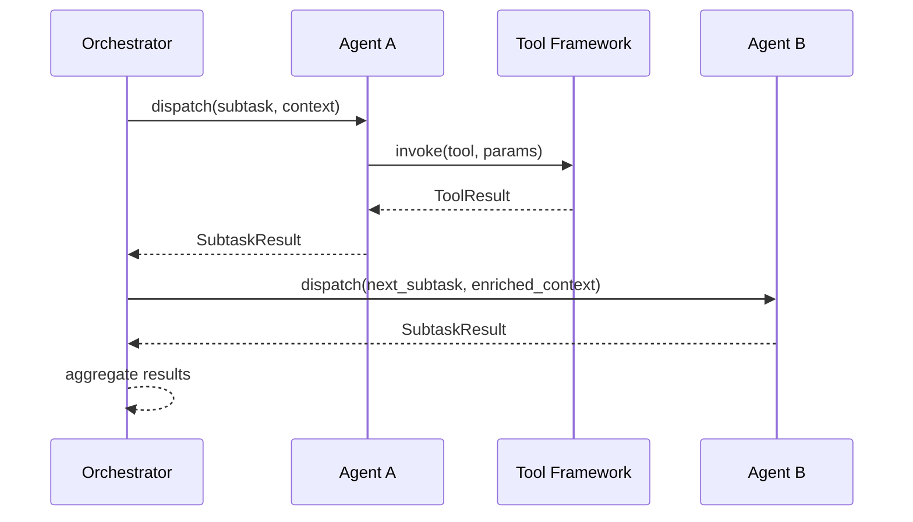
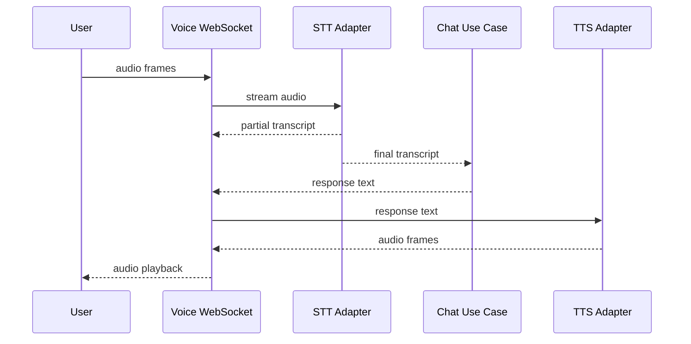
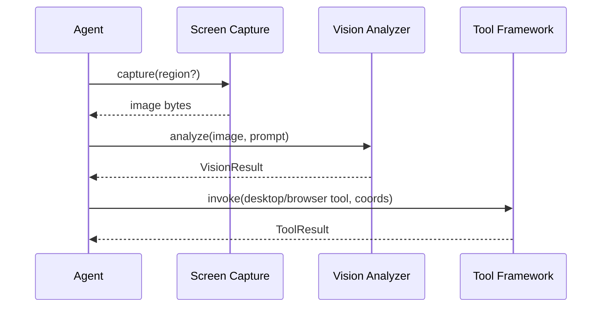
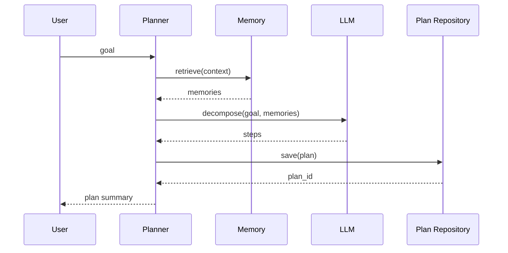
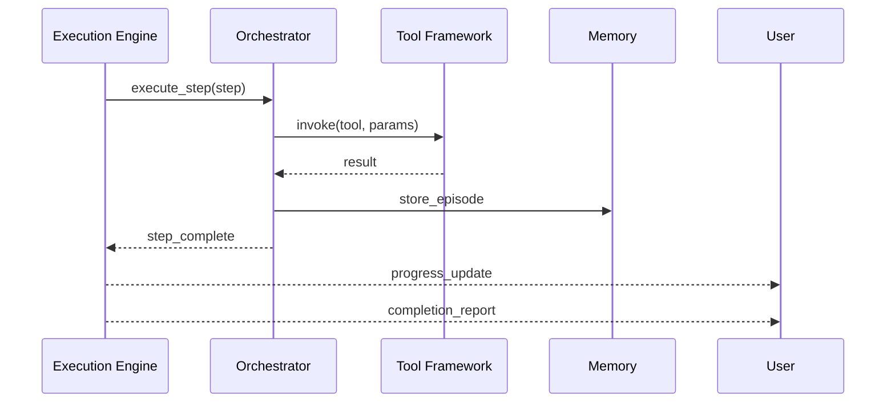

# Jarvis OS — Architecture

> **Audience:** Engineers implementing or reviewing system design.  
> **Companion docs:** [SYSTEM_OVERVIEW.md](SYSTEM_OVERVIEW.md) · [TECH_STACK.md](TECH_STACK.md) · [ROADMAP.md](ROADMAP.md)

---

## 1. High-Level Architecture

Jarvis OS follows **Clean Architecture** with an **async-first** design. Frameworks and external systems sit at the outer edge; business rules remain testable at the center.

```
                              ┌─────────────────┐
                              │      USER       │
                              └────────┬────────┘
                                       │
         ┌─────────────────────────────┼─────────────────────────────┐
         │                             │                             │
         ▼                             ▼                             ▼
  ┌─────────────┐              ┌─────────────┐              ┌─────────────┐
  │  REST API   │              │  WebSocket  │              │   Voice WS  │
  │  (FastAPI)  │              │  Streaming  │              │  Interface  │
  └──────┬──────┘              └──────┬──────┘              └──────┬──────┘
         │                             │                             │
         └─────────────────────────────┼─────────────────────────────┘
                                       │
┌──────────────────────────────────────▼──────────────────────────────────────┐
│                         PRESENTATION LAYER  (`api/`)                         │
│              Routes · Schemas · Middleware · Dependencies                    │
└──────────────────────────────────────┬──────────────────────────────────────┘
                                       │
┌──────────────────────────────────────▼──────────────────────────────────────┐
│                        APPLICATION LAYER  (`application/`)                 │
│   Use Cases · AI Router · Planner · Agent Orchestrator · Port Interfaces   │
└──────────────────────────────────────┬──────────────────────────────────────┘
                                       │
┌──────────────────────────────────────▼──────────────────────────────────────┐
│                           DOMAIN LAYER  (`domain/`)                          │
│            Entities · Value Objects · Domain Services · Repo Protocols       │
└──────────────────────────────────────┬──────────────────────────────────────┘
                                       │
┌──────────────────────────────────────▼──────────────────────────────────────┐
│                      INFRASTRUCTURE LAYER  (`infrastructure/`)             │
│  LLM · Memory · Tools · Desktop · Browser · Voice · Vision · Integrations    │
└─────────────────────────────────────────────────────────────────────────────┘
```

### Architectural Principles

| # | Principle | Implementation |
|---|-----------|----------------|
| 1 | Dependency Inversion | Inner layers define interfaces; outer layers implement |
| 2 | Single Responsibility | One module, one bounded capability |
| 3 | Async by Default | All I/O via `async`/`await` |
| 4 | Fail Safe | Domain exceptions; no silent failures on privileged ops |
| 5 | Observable | Correlation ID on every cross-boundary call |
| 6 | Plugin Ready | Tools register via framework; core unchanged |

---

## 2. Module Responsibilities

| Module | Path | Responsibility | May Import |
|--------|------|----------------|------------|
| **Core** | `core/` | Config, logging, DI wiring, base exceptions | stdlib, pydantic |
| **Domain** | `domain/` | Entities, invariants, repository protocols | stdlib only |
| **Application** | `application/` | Use cases, DTOs, port interfaces, orchestration | `domain`, `core` |
| **Infrastructure** | `infrastructure/` | Adapters for DB, LLM, tools, integrations | `application`, `domain`, `core` |
| **API** | `api/` | HTTP/WS handlers, request/response schemas | `application`, `core` |

### Subsystem Map

| Subsystem | Layer | Phase | Responsibility |
|-----------|-------|-------|----------------|
| AI Router | Application | 2 | Intent → model/agent selection |
| Memory | Infra + Domain | 3 | Store, retrieve, search memories |
| Tool Framework | Application + Infra | 4 | Register, validate, execute, audit |
| Desktop Automation | Infrastructure | 5 | Window/input control |
| Voice | Infrastructure | 6 | STT/TTS streaming |
| Vision | Infrastructure | 7 | Screen capture and analysis |
| Browser Automation | Infrastructure | 8 | Playwright web control |
| GitHub / Docker / K8s / AWS / Hostinger | Infrastructure | 9–13 | Cloud and dev integrations |
| Planner | Application | 14 | Goal → plan graph |
| Agent Orchestrator | Application | 15 | Multi-agent dispatch and execution |
| Plugin System | Application + Infra | 4+ | External tool registration |

---

## 3. Folder Responsibilities

```
jarvis-os/
├── src/jarvis/
│   ├── main.py                 # Entry point: uvicorn target
│   │
│   ├── core/
│   │   ├── config.py           # Settings (pydantic-settings)
│   │   ├── logging.py          # Structured logging setup
│   │   ├── exceptions.py       # DomainError hierarchy root
│   │   └── dependencies.py     # DI container and bindings
│   │
│   ├── domain/
│   │   ├── entities/           # Task, Plan, Agent, Memory, ToolInvocation
│   │   ├── value_objects/      # IDs, Status, Scope, Permission
│   │   ├── services/           # Pure domain logic (no I/O)
│   │   └── repositories/       # Protocol definitions for persistence
│   │
│   ├── application/
│   │   ├── use_cases/          # One class per use case
│   │   ├── dto/                # Input/output data transfer objects
│   │   ├── interfaces/         # Ports: LLMProvider, ToolExecutor, MemoryStore, etc.
│   │   └── services/           # Router, Planner, AgentOrchestrator
│   │
│   ├── infrastructure/
│   │   ├── persistence/        # PostgreSQL, pgvector implementations
│   │   ├── llm/                # OpenAI, Anthropic, etc. adapters
│   │   ├── tools/              # Tool executor, registry, built-in tools
│   │   ├── integrations/       # GitHub, Docker, K8s, AWS, Hostinger, Cursor
│   │   ├── automation/         # Desktop, browser, terminal adapters
│   │   ├── voice/              # STT/TTS adapters
│   │   ├── vision/             # Screen capture and vision model adapters
│   │   └── plugins/            # Plugin loader and validator
│   │
│   └── api/
│       ├── app.py              # create_app() factory
│       ├── middleware/         # Correlation ID, auth, rate limit
│       └── v1/
│           ├── routes/         # Thin route handlers
│           ├── schemas/        # Pydantic request/response models
│           └── dependencies/   # Route-level FastAPI Depends
│
├── tests/
│   ├── unit/                   # Domain and use case tests
│   ├── integration/            # Adapter tests
│   └── e2e/                    # Full flow tests (later phases)
│
├── deploy/                     # Docker, K8s, Terraform (Phase 16)
├── scripts/                    # Dev and ops utilities
└── docs/                       # Supplementary documentation
```

### Folder Rules

| Rule | Detail |
|------|--------|
| One use case per file | `execute_task.py` contains `ExecuteTaskUseCase` only |
| Schemas ≠ entities | API schemas in `api/`; domain entities in `domain/` |
| Adapters in infrastructure only | No `boto3` or `playwright` imports outside `infrastructure/` |
| Tests mirror source | `tests/unit/application/test_execute_task.py` |

---

## 4. Clean Architecture

### Layer Dependency Diagram

```
                    ┌─────────────┐
                    │     api     │
                    └──────┬──────┘
                           │
                    ┌──────▼──────┐
                    │ application │
                    └──────┬──────┘
                           │
                    ┌──────▼──────┐         ┌─────────────────┐
                    │   domain    │◄────────│ infrastructure  │
                    └─────────────┘         └─────────────────┘
                           ▲
                    ┌──────┴──────┐
                    │    core     │
                    └─────────────┘
```

### Allowed vs Forbidden Imports

| From | To | Status |
|------|-----|--------|
| `api` | `application`, `core` | Allowed |
| `application` | `domain`, `core` | Allowed |
| `infrastructure` | `application`, `domain`, `core` | Allowed |
| `domain` | stdlib | Allowed |
| `domain` | `application`, `infrastructure`, `api` | **Forbidden** |
| `application` | `infrastructure` | **Forbidden** — use ports |
| `api` | `infrastructure` | **Forbidden** — use use cases |

### Request Lifecycle

```
HTTP Request
  → Middleware (correlation ID, auth)
  → Route handler (Pydantic validation)
  → Use case (business logic)
  → Port interface (abstract)
  → Infrastructure adapter (concrete)
  → External system
  ← DTO mapped to API response schema
```

---

## 5. Dependency Injection

### Strategy

| Concern | Mechanism |
|---------|-----------|
| Use case dependencies | Constructor injection |
| API route dependencies | FastAPI `Depends()` |
| Binding (interface → impl) | `core/dependencies.py` |
| Lifespan resources | FastAPI `lifespan` context manager |
| Settings | Singleton `Settings` loaded at startup |

### Binding Flow

```
Startup (lifespan)
  → Load Settings from environment
  → Configure structured logging
  → Instantiate infrastructure adapters
  → Bind adapters to port interfaces
  → Register in DI container
  → create_app() attaches routes with Depends()
```

### Example Pattern

```python
# application/interfaces/llm.py
class LLMProvider(Protocol):
    async def complete(self, prompt: str) -> str: ...

# infrastructure/llm/openai.py
class OpenAIProvider:
    async def complete(self, prompt: str) -> str: ...

# core/dependencies.py
def get_llm_provider(settings: Settings) -> LLMProvider:
    return OpenAIProvider(api_key=settings.openai_api_key)

# api/v1/routes/chat.py
@router.post("/chat")
async def chat(
    body: ChatRequest,
    use_case: ChatUseCase = Depends(get_chat_use_case),
) -> ChatResponse:
    return await use_case.execute(body)
```

### Rules

- No global mutable singletons for services.
- Use cases receive ports via `__init__`, never import adapters directly.
- Test use cases by injecting mock ports.

---

## 6. SOLID Principles

| Principle | Application |
|-----------|-------------|
| **S** — Single Responsibility | One use case per class; one tool per executor module |
| **O** — Open/Closed | New tools via registration; new LLM via adapter |
| **L** — Liskov Substitution | All adapters honor their port contracts |
| **I** — Interface Segregation | Small protocols: `LLMProvider`, `MemoryStore`, `ToolExecutor` |
| **D** — Dependency Inversion | Use cases depend on `Protocol`, not concrete SDKs |

**Composition over inheritance:** Prefer injecting behavior via ports rather than subclassing base adapters.

---

## 7. Design Patterns

| Pattern | Usage in Jarvis OS |
|---------|-------------------|
| **Repository** | Abstract persistence for memory, plans, audit logs |
| **Strategy** | Swappable LLM providers, routing strategies |
| **Factory** | `create_app()`, agent/tool factories |
| **Adapter** | Wrap GitHub, Docker, AWS SDKs behind ports |
| **Command** | Tool invocations as typed command objects |
| **Chain of Responsibility** | AI router fallback across models |
| **Decorator** | Retry, timeout, audit wrappers on tool execution |
| **Observer / Event Bus** | Plan step events, tool audit events (Phase 14+) |
| **Registry** | Tool and plugin registration |
| **Unit of Work** | Transaction boundaries for plan + memory writes |

---

## 8. Agent Communication

Agents do not call each other directly. The **Agent Orchestrator** mediates all inter-agent communication.

```
┌──────────┐     ┌────────────────────┐     ┌──────────┐
│ Agent A  │────►│ Agent Orchestrator │────►│ Agent B  │
│ (Planner)│     │  (context handoff)  │     │ (Coder)  │
└──────────┘     └─────────┬──────────┘     └──────────┘
                           │
                    ┌──────▼──────┐
                    │ Tool Framework│
                    └─────────────┘
```

### Communication Rules

| Rule | Detail |
|------|--------|
| Context handoff | Orchestrator passes structured context, not raw objects |
| Tool access | Each agent has a scoped tool allowlist |
| Message format | Typed DTOs between orchestrator and agents |
| Audit | Every agent action logged with agent ID and correlation ID |
| Parallelism | Independent agent tasks run via `asyncio.gather()` |



---

## 9. Memory Flow

```
┌──────┐    write     ┌─────────────┐    embed    ┌──────────────┐
│Agent │─────────────►│ MemoryStore │────────────►│ Vector Index │
└──┬───┘              └──────┬──────┘             └──────┬───────┘
   │                         │                           │
   │  read (semantic query)  │                           │
   │◄────────────────────────┤◄──────────────────────────┘
   │                         │
   ▼                         ▼
┌──────────────────────────────────────┐
│  Episodic Store  │  Semantic Store  │
│  (task history)  │  (facts/prefs)   │
└──────────────────────────────────────┘
```

### Write Path

1. Agent completes a task or learns a fact.
2. Use case creates `Memory` entity with type (episodic / semantic).
3. `MemoryStore` persists to PostgreSQL.
4. Embedding generated and stored in pgvector.
5. Audit log records the write.

### Read Path

1. Use case receives a query (text or context).
2. Query embedded via embedding provider.
3. Vector similarity search returns top-k candidates.
4. Results ranked, filtered by relevance threshold.
5. Enriched context returned to agent or planner.

### Rules

- Memory writes never bypass the use case layer.
- PII fields optionally redacted before embedding.
- User can explicitly delete memories (FR-3.4).

---

## 10. Voice Flow

```
User (microphone)
  → WebSocket audio stream
  → API voice endpoint
  → STT Adapter (speech → text)
  → ChatUseCase (same pipeline as text)
  → AI Router → Agent → Response text
  → TTS Adapter (text → audio)
  → WebSocket audio stream
  → User (speaker)
```



### Rules

- Voice sessions linked to conversation session ID.
- Fallback to text if STT/TTS unavailable.
- Audio not persisted unless explicitly configured.

---

## 11. Vision Flow

```
Trigger (user request or planner step)
  → Screen Capture Adapter
  → Image (PNG/JPEG)
  → Optional PII redaction
  → Vision Analyzer (multimodal LLM)
  → Structured description / element map
  → Agent or Planner (decision)
  → Optional: Tool Framework (click, type based on vision)
```



---

## 12. Desktop Automation Flow

```
Agent requests desktop action
  → Tool Framework (validate schema + permissions)
  → Approval gate (if high-risk)
  → DesktopAutomation port
  → Platform adapter (Windows / macOS / Linux)
  → OS APIs (Win32, Quartz, X11)
  → Result → Audit log → Agent
```

| Action | Risk Level | Approval |
|--------|-----------|----------|
| Screenshot | Low | Auto |
| Focus window | Low | Auto |
| Click / type | Medium | Configurable |
| Close application | High | Required |
| System settings change | Critical | Required |

---

## 13. Browser Automation Flow

```
Agent requests browser action
  → Tool Framework (validate + permission check)
  → Domain allowlist check
  → BrowserAutomation port
  → Playwright adapter
  → Browser context (isolated per task)
  → Action (navigate, click, fill, extract)
  → Result → Audit log → Agent
  → Context cleanup on completion/timeout
```

### Session Lifecycle

```
create context → navigate → interact → extract → close context
                     ↑                              │
                     └── timeout watchdog ──────────┘
```

---

## 14. Planner Flow

```
User goal (natural language)
  → PlannerService
  → MemoryStore.retrieve(relevant context)
  → LLMProvider (decompose goal into steps)
  → Plan entity (steps, dependencies, metadata)
  → PlanRepository.persist(plan)
  → Return plan ID to user/orchestrator
```



### Plan Structure

```
Plan
├── id
├── goal
├── status: pending | running | completed | failed | cancelled
├── steps[]
│   ├── id
│   ├── description
│   ├── tool_name (optional)
│   ├── dependencies[]
│   └── status
└── metadata (created_at, correlation_id)
```

---

## 15. Execution Flow

```
Plan (approved)
  → ExecutionEngine
  → For each step (respecting dependencies):
      → Resolve agent for step
      → Approval gate (if high-risk)
      → Tool Framework.invoke(tool, params)
      → Store episode in Memory
      → Update step status
  → On failure: retry policy or escalation
  → On completion: aggregate results → user notification
```



---

## 16. Error Handling Strategy

### Exception Hierarchy

```
JarvisError (base)
├── DomainError
│   ├── ValidationError
│   ├── NotFoundError
│   └── PermissionDeniedError
├── ApplicationError
│   ├── ToolExecutionError
│   ├── PlanExecutionError
│   └── RouterError
└── InfrastructureError
    ├── ProviderUnavailableError
    └── AdapterError
```

### Handling Rules

| Layer | Responsibility |
|-------|---------------|
| Domain | Raise domain exceptions with context |
| Application | Catch infra errors; wrap in application exceptions |
| Infrastructure | Catch SDK errors; wrap in `InfrastructureError` |
| API | Global exception handler maps to HTTP status + error envelope |

### Error Response Envelope

```json
{
  "error": {
    "code": "TOOL_EXECUTION_FAILED",
    "message": "Tool 'run_shell' timed out after 30s",
    "correlation_id": "550e8400-e29b-41d4-a716-446655440000"
  }
}
```

### Retry Policy

| Error type | Retry | Backoff |
|------------|-------|---------|
| Provider timeout | Yes | Exponential, max 3 |
| Rate limit | Yes | Respect `Retry-After` |
| Validation error | No | Immediate fail |
| Permission denied | No | Immediate fail |

---

## 17. Logging Strategy

| Aspect | Standard |
|--------|----------|
| Library | stdlib `logging` |
| Dev format | Human-readable text |
| Prod format | Structured JSON |
| Correlation ID | `X-Correlation-ID` header → all log records |
| Levels | DEBUG (dev), INFO (ops), WARNING, ERROR |

### Required Log Fields (Production)

```json
{
  "timestamp": "2026-07-01T12:00:00Z",
  "level": "INFO",
  "message": "Tool executed",
  "correlation_id": "uuid",
  "subsystem": "tool_framework",
  "tool_name": "run_shell",
  "duration_ms": 142,
  "success": true
}
```

### What to Log

| Event | Level | Fields |
|-------|-------|--------|
| Request received | INFO | method, path, correlation_id |
| Tool invoked | INFO | tool_name, duration, success |
| Tool failed | ERROR | tool_name, error_code, correlation_id |
| Approval required | WARNING | tool_name, agent_id |
| External provider down | ERROR | provider, error |

### What NOT to Log

- API keys, tokens, passwords
- Full PII (email bodies, credentials)
- Complete tool params if they contain secrets

---

## 18. Security Strategy

| Layer | Control |
|-------|---------|
| Transport | TLS in production |
| Authentication | API keys / OAuth (Phase 1+) |
| Authorization | Per-agent tool scopes and permission model |
| Input validation | Pydantic at API and tool boundaries |
| Secrets | Environment variables only; `SecretStr` in settings |
| Audit | All privileged tool invocations logged |
| Approval | Configurable gates for destructive operations |
| Sandboxing | Shell commands via allowlist; browser via domain allowlist |
| CORS | Explicit origins; no wildcard in production |

---

## 19. Plugin System

### Design

Plugins extend Jarvis OS with new tools without modifying core code.

```
Plugin package
  → manifest.json (name, version, tools[])
  → tool definitions (name, schema, handler)
  → PluginLoader validates and registers
  → Tool Framework makes available to agents
```

### Plugin Contract

| Field | Type | Description |
|-------|------|-------------|
| `name` | string | Unique plugin identifier |
| `version` | semver | Plugin version |
| `tools` | array | Tool definitions with JSON Schema inputs |
| `permissions` | array | Required permission scopes |
| `handler` | callable | Async function implementing tool logic |

### Rules

- Plugins run in the same process initially; subprocess isolation evaluated later.
- Plugin loading requires explicit enablement in config.
- Plugins cannot override core tools.
- All plugin invocations audited identically to built-in tools.

---

## 20. Future MCP Integration

[Model Context Protocol (MCP)](https://modelcontextprotocol.io/) provides a standard for tool and context exchange between AI applications and external systems.

### Planned Integration (Post Phase 16)

```
Jarvis OS
  ├── MCP Server (expose Jarvis tools to external clients)
  └── MCP Client (consume external MCP tool servers)
```

| Role | Description |
|------|-------------|
| MCP Server | External apps (e.g., Cursor) invoke Jarvis tools via MCP |
| MCP Client | Jarvis discovers and invokes third-party MCP tool servers |

### Design Constraints

- MCP adapters live in `infrastructure/integrations/mcp/`.
- MCP tools map to the existing Tool Framework registry.
- No MCP-specific logic in domain or application layers.
- MCP auth follows the same scoping and audit rules as native tools.

---

## 21. Technology Boundaries by Phase

| Concern | Available From |
|---------|---------------|
| FastAPI runtime | Phase 1 |
| LLM providers | Phase 2 |
| PostgreSQL + pgvector | Phase 3 |
| Tool framework | Phase 4 |
| Desktop / voice / vision / browser | Phases 5–8 |
| Cloud integrations | Phases 9–13 |
| Redis queue | Phase 14 |
| Production deployment | Phase 16 |
| MCP | Post Phase 16 |

---

## 22. Cross-Reference

| Topic | Document |
|-------|----------|
| Product requirements | [PROJECT.md](PROJECT.md) |
| Technology choices | [TECH_STACK.md](TECH_STACK.md) |
| Delivery schedule | [ROADMAP.md](ROADMAP.md) |
| Coding standards | [CURSOR_RULES.md](CURSOR_RULES.md) |
| Onboarding | [SYSTEM_OVERVIEW.md](SYSTEM_OVERVIEW.md) |
