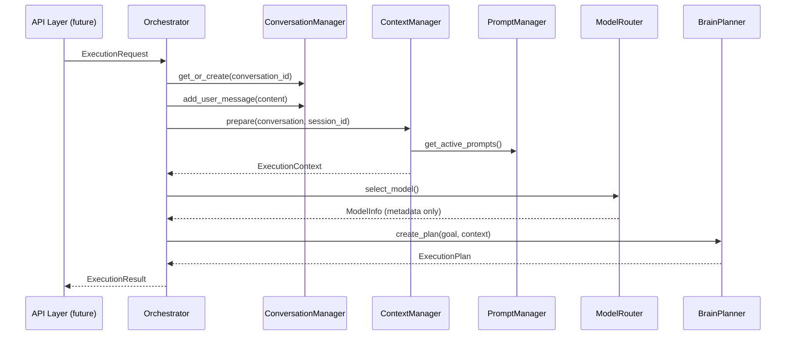

# Sprint 2 — Brain AI Core Design

> **Status:** Architecture complete — no LLM providers, no execution, no memory storage.  
> **Package:** `app/brain/`

---

## 1. What Is the Brain?

The **Brain** is Jarvis OS's AI Core. It is the central nervous system that:

1. **Receives** user requests
2. **Tracks** conversations and message history
3. **Prepares** execution context (conversation + prompts + session + environment + future memory)
4. **Resolves** prompts from versioned templates
5. **Routes** to the appropriate LLM model (metadata only in Sprint 2)
6. **Plans** multi-step execution plans
7. **Returns** structured results to upper layers (API, agents)

The Brain **does not**:

- Call OpenAI, Anthropic, Gemini, OpenRouter, or any LLM API (Sprint 2)
- Execute plan tasks
- Store long-term semantic memory
- Run agents or automation tools

---

## 2. Package Structure

```
app/brain/
├── __init__.py                 # Public exports
├── factory.py                  # build_brain() DI wiring
├── orchestrator.py             # Central coordinator
├── conversation_manager.py     # Conversation lifecycle
├── context_manager.py          # Context merging
├── prompt_manager.py           # Prompt templates & resolution
├── planner.py                  # BrainPlanner (plan generation only)
├── model_router.py             # Model metadata & provider registry
├── exceptions.py               # Brain-specific errors
│
├── schemas/                    # Pydantic domain models
│   ├── conversation.py       # Message, Conversation, MessageRole
│   ├── plan.py                 # Task, ExecutionPlan, statuses
│   ├── context.py              # ExecutionContext
│   ├── prompt.py               # Prompt, PromptTemplate, PromptType
│   ├── llm.py                  # LLMRequest, LLMResponse, ModelInfo
│   └── execution.py            # ExecutionRequest, ExecutionResult
│
├── interfaces/                 # Port protocols (dependency inversion)
│   ├── llm_provider.py         # LLMProvider
│   ├── planner.py              # Planner
│   ├── prompt_provider.py      # PromptProvider
│   ├── conversation_store.py   # ConversationStore
│   └── context_provider.py     # ContextProvider
│
└── stores/                     # Sprint 2 in-memory adapters
    ├── conversation_store.py   # InMemoryConversationStore
    ├── prompt_provider.py      # InMemoryPromptProvider
    └── context_provider.py     # StubContextProvider
```

---

## 3. How the Brain Works

### Component Responsibilities

| Component | Responsibility | Executes Tasks? | Calls LLM? |
|-----------|---------------|-----------------|------------|
| **Orchestrator** | Coordinates full pipeline | No | No |
| **ConversationManager** | IDs, messages, roles, metadata | No | No |
| **ContextManager** | Merge conversation + prompts + session + env + memory | No | No |
| **PromptManager** | System/developer/user/tool/safety prompts | No | No |
| **ModelRouter** | Select model metadata, register providers | No | No |
| **BrainPlanner** | Generate `ExecutionPlan` from goal | No | No |

### Dependency Graph

```
Orchestrator
    ├── ConversationManager → ConversationStore (port)
    ├── ContextManager → ContextProvider (port)
    │                  → PromptManager → PromptProvider (port)
    ├── PromptManager
    ├── ModelRouter → LLMProvider (port, not registered in Sprint 2)
    └── BrainPlanner (implements Planner port)
```

All dependencies are **constructor-injected** via `build_brain()` in `factory.py` and exposed through `ServiceContainer.brain`.

---

## 4. Request Flow



### Example: "Deploy my website"

```
User Input: "Deploy my website"
        │
        ▼
ConversationManager
  • Create conversation ID
  • Append user message
        │
        ▼
ContextManager
  • Load session context
  • Load environment (app_env, version)
  • Memory: [] (future: semantic retrieval)
  • Attach system + safety + developer prompts
        │
        ▼
ModelRouter
  • select_model() → ModelInfo (no API call)
        │
        ▼
BrainPlanner
  • create_plan() → ExecutionPlan:
      1. Analyze Request
      2. Prepare Environment
      3. Execute Primary Action
      4. Verify Outcome
      5. Report Result
        │
        ▼
ExecutionResult
  status: planned
  plan: ExecutionPlan
  conversation_id: <uuid>
```

---

## 5. How Planning Works

### Design Principles

1. **Plan only, never execute** — `BrainPlanner.create_plan()` returns `ExecutionPlan` with `PlanStatus.DRAFT`.
2. **Planner port** — `interfaces/planner.py` allows LLM-assisted planning in Sprint 3+ without changing the Orchestrator.
3. **Tasks are ordered** — Each `Task` has `order`, `dependencies`, and `TaskStatus.PENDING`.

### Plan Schema

```python
ExecutionPlan
├── id: str
├── goal: str                    # "Deploy my website"
├── status: PlanStatus           # draft | approved | running | ...
├── conversation_id: str | None
├── tasks: list[Task]
│   ├── order: int
│   ├── title: str
│   ├── description: str
│   ├── dependencies: list[str]
│   └── status: TaskStatus
└── metadata: dict
```

### Sprint 2 vs Future

| Aspect | Sprint 2 | Future |
|--------|----------|--------|
| Plan content | Deterministic placeholder tasks | LLM-assisted decomposition |
| LLM usage | None | Via `LLMProvider.complete()` |
| Execution | None | Agent Orchestrator (Sprint 15) |
| Approval gates | None | Human-in-the-loop before execution |

---

## 6. How Future Agents Connect

Agents will **not** be embedded inside the Brain. They connect as **downstream executors**:

```
Brain (planning)
    │
    ▼
ExecutionPlan (approved)
    │
    ▼
Agent Orchestrator (future — Sprint 15)
    ├── Agent: Coder      → tools: github, terminal
    ├── Agent: DevOps     → tools: docker, k8s, aws
    └── Agent: Browser    → tools: playwright
    │
    ▼
Tool Framework (Sprint 4)
```

### Integration Points

| Brain Component | Agent Integration |
|-----------------|-------------------|
| `ExecutionPlan.tasks` | Each task maps to an agent role + tool set |
| `ExecutionContext` | Passed to agents as shared context |
| `ConversationManager` | Agents append assistant/tool messages |
| `Orchestrator` | Will dispatch plans to Agent Orchestrator |

The Orchestrator interface will gain a `dispatch(plan)` method in a future sprint without breaking `execute()`.

---

## 7. How Future Memory Connects

Long-term memory is **not implemented** in Sprint 2. The integration point is defined:

### ContextProvider.get_memory_context()

```python
async def get_memory_context(
    query: str,
    conversation: Conversation | None,
) -> list[dict[str, Any]]:
    ...
```

### Sprint 2 Behavior

`StubContextProvider` returns `[]` for all memory queries.

### Future Behavior (Sprint 3 — Memory)

```
ContextManager.prepare()
    │
    ▼
MemoryAdapter (implements memory retrieval)
    ├── Semantic search (pgvector)
    ├── Episodic recall (past tasks)
    └── User preferences
    │
    ▼
ExecutionContext.memory = [{...}, {...}]
```

### Migration Path

1. Implement `MemoryStore` port in `app/brain/interfaces/` (or `app/interfaces/`)
2. Create `MemoryContextProvider` adapter in `app/brain/stores/`
3. Replace `StubContextProvider` in `build_brain()` via configuration
4. No changes to `Orchestrator` or `ContextManager` public APIs

---

## 8. How LLM Providers Connect

### Interface: `LLMProvider`

```python
class LLMProvider(Protocol):
    @property
    def provider_name(self) -> str: ...

    async def list_models(self) -> list[ModelInfo]: ...
    async def complete(self, request: LLMRequest) -> LLMResponse: ...
    async def health_check(self) -> bool: ...
```

### Supported Providers (metadata only)

| Provider | Enum Value | Sprint 2 Status |
|----------|-----------|-----------------|
| OpenAI | `openai` | Interface only |
| Anthropic | `anthropic` | Interface only |
| Gemini | `gemini` | Interface only |
| OpenRouter | `openrouter` | Interface only |
| DeepSeek | `deepseek` | Interface only |
| Ollama | `ollama` | Interface only |
| LM Studio | `lm_studio` | Interface only |

### ModelRouter

```python
router = ModelRouter(default_provider=LLMProviderName.OPENAI)

# Sprint 2: metadata selection works
model = router.select_model(provider=LLMProviderName.ANTHROPIC)

# Sprint 2: adapter call raises ModelRoutingError
provider = router.get_provider(LLMProviderName.OPENAI)  # not registered
```

### Future Adapter Registration

```python
# Future sprint — app/brain/adapters/openai.py
class OpenAIProvider:
    async def complete(self, request: LLMRequest) -> LLMResponse: ...

router.register_provider(LLMProviderName.OPENAI, OpenAIProvider(...))
```

### Wiring in factory.py

```python
def build_brain(settings: Settings) -> BrainContainer:
    model_router = ModelRouter()
    # Future: model_router.register_provider(... based on settings)
    ...
```

---

## 9. Schemas Reference

| Schema | Purpose |
|--------|---------|
| `Message` | Single conversation message with role |
| `Conversation` | Tracked session with history and metadata |
| `Task` | Single step in an execution plan |
| `ExecutionPlan` | Full plan with ordered tasks |
| `ExecutionContext` | Merged context for planning/LLM |
| `Prompt` | Resolved prompt text |
| `PromptTemplate` | Versioned template with variables |
| `LLMRequest` | Provider request payload |
| `LLMResponse` | Provider response payload |
| `ModelInfo` | Model metadata and capabilities |
| `ExecutionRequest` | Orchestrator input |
| `ExecutionResult` | Orchestrator output |

---

## 10. Interfaces Reference

| Interface | Implementations (Sprint 2) | Future |
|-----------|-------------------------|--------|
| `ConversationStore` | `InMemoryConversationStore` | PostgreSQL adapter |
| `PromptProvider` | `InMemoryPromptProvider` | File/DB provider |
| `ContextProvider` | `StubContextProvider` | Memory-aware provider |
| `Planner` | `BrainPlanner` | LLM-assisted planner |
| `LLMProvider` | None | OpenAI, Anthropic, etc. |

---

## 11. Dependency Injection

```python
# app/dependencies/container.py
ServiceContainer
├── settings
├── health_service
└── brain: BrainContainer
        ├── orchestrator
        ├── conversation_manager
        ├── context_manager
        ├── prompt_manager
        ├── model_router
        └── planner
```

Access in FastAPI routes (future):

```python
def get_brain(request: Request) -> BrainContainer:
    return request.app.state.container.brain

BrainDep = Annotated[BrainContainer, Depends(get_brain)]
```

---

## 12. Clean Architecture Alignment

```
┌─────────────────────────────────────────────┐
│  API (future /v1/chat, /v1/plan)            │
└────────────────────┬────────────────────────┘
                     │
┌────────────────────▼────────────────────────┐
│  brain/orchestrator.py   (application)      │
│  brain/*_manager.py      (application)      │
└────────────────────┬────────────────────────┘
                     │
┌────────────────────▼────────────────────────┐
│  brain/schemas/          (domain models)      │
│  brain/interfaces/       (ports)              │
└────────────────────┬────────────────────────┘
                     │
┌────────────────────▼────────────────────────┐
│  brain/stores/           (adapters)           │
│  brain/adapters/         (future LLM adapters)│
└─────────────────────────────────────────────┘
```

---

## 13. Sprint 2 Boundaries

### In Scope

- Full Brain package architecture
- All schemas and interfaces
- In-memory conversation and prompt stores
- Placeholder planner with structural plans
- Model router with provider metadata
- Orchestrator pipeline (no LLM, no execution)
- DI wiring via `ServiceContainer.brain`
- Architecture tests

### Out of Scope

- LLM API connections
- Long-term memory storage
- Agent execution
- Browser/desktop automation
- REST API endpoints for Brain (Sprint 2 API task)
- Authentication middleware

---

## 14. Next Steps (Sprint 3+)

| Sprint | Task |
|--------|------|
| 2b | `POST /v1/brain/execute` API endpoint + auth |
| 3 | Memory adapter replacing `StubContextProvider` |
| 3 | First `LLMProvider` adapter (config-selected) |
| 3 | LLM-assisted `BrainPlanner` |
| 4 | Tool framework integration for plan execution |
| 15 | Agent Orchestrator consumes `ExecutionPlan` |

---

## 15. Usage Example (Internal)

```python
from app.brain import build_brain
from app.brain.schemas.execution import ExecutionRequest
from app.config.settings import get_settings

brain = build_brain(get_settings())

request = ExecutionRequest(user_input="Deploy my website")
result = await brain.orchestrator.execute(request)

print(result.status)           # planned
print(result.plan.goal)        # Deploy my website
print(len(result.plan.tasks))  # 5
print(result.conversation_id)  # <uuid>
```

---

## 16. Quality Checklist

- [x] Google-style docstrings on all public classes
- [x] Type hints on all public APIs
- [x] No file exceeds 400 lines
- [x] No LLM provider connections
- [x] No memory persistence
- [x] No agent execution
- [x] SOLID: ports, DI, single responsibility per module
- [x] Composition over inheritance
- [x] Backwards compatible: existing health API unchanged
